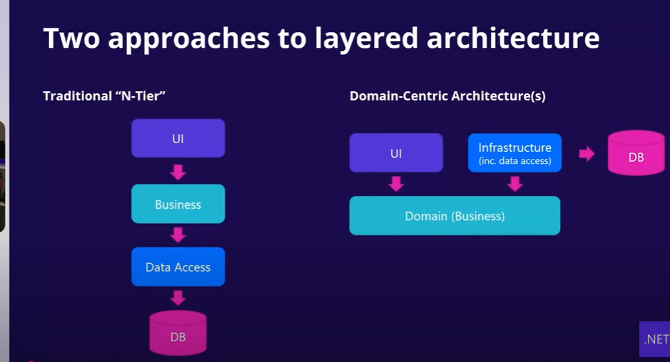

/MyApp
|---/MyApp.API                          (Presentation Layer)
|---/MyApp.Application                (Presentation Layer)
|---/MyApp.Domain                (Presentation Layer)
|---/MyApp.Infrastructure                (Presentation Layer)
|---/MyApp.API                (Presentation Layer)

## Testing is difficualt in normal archi 
## Always dependencies comes in way 

## Clean Archi
- Domain Centric
- Before Database Centric

## When Use 
- Domain-Driven Design focus on domain not infrastructure
- Highly Testable
- Complex business logic
- Instead of developor doing right thing we create architecture that make them do the right thing

## Layered Architecture

Traditional N-tire Archi
- UI => Business => Data access => Db
- Everything depends on db

Clean ARchi
- UI => Domain
- Infra => Domain

If we put everything in one project compiler will not tell what depends on what 

Domain Model and Arbstration => Infra
Domain Model and Arbstration => Test Project
Domain Model and Arbstration => Web Project

## Tempalte given 
- Ardalis Clean Architecuture

## Clean Archi Rules
- Model all business rules and entities in core project
- All dependencires flow toward core porject
- Inner porject define interfaces 
Outer project implemets

## Core Project
- Interfaces (what need to happen)
- Aggregates (Group of entities)
- Entities (Everything that have id)
- Value Objects (Properties of obj)
- Domain Servies (Anything that doseing go in above 4)
- Domain Exceptions
- Domain Events  | Event Handlers
- Specifications (linq)
- Validator
- Enums
- Custom Guards

## CQRS (optional)
UseCaes project 
- Commands
- Queries
- DTos
- Behaviours

## Infra
- Repo
- Dbcontext
- Cached Repo
- Api clients (3rd party api)

Note -  just call the raw sql get the data in info

## Web 
- Controller
- Interfaces and model tied to web like viewmodels
 

 - Mediator
 - Fluent Validator
 
 ## Shared Kernal 

 ## Try it yourself develop some shit then only u will understand 

